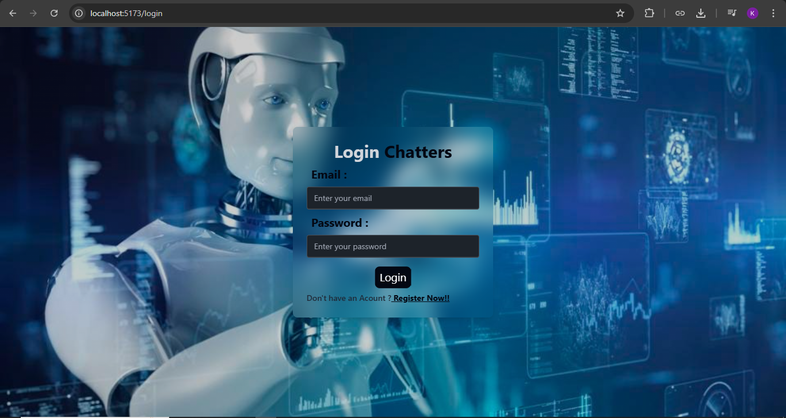
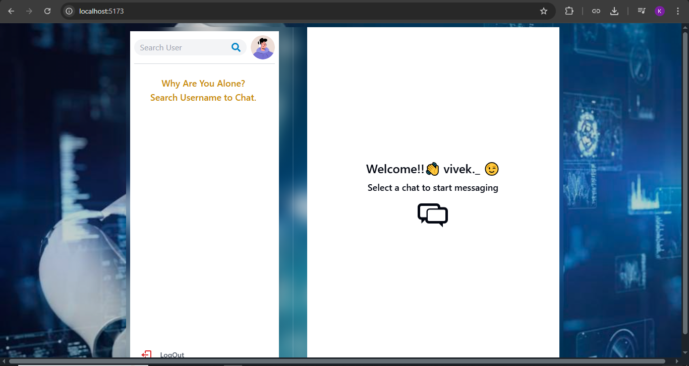
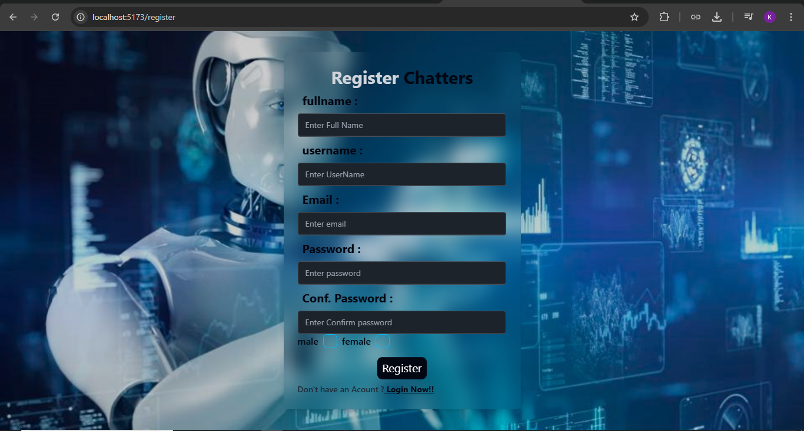

# 💬 MERN Real-Time Chat Application

A **real-time chat application** built with the MERN stack (**MongoDB, Express.js, React.js, Node.js**) and **Socket.io** for instant messaging.  
This app allows two or more users to chat instantly by opening multiple browser windows (normal + incognito).

---

## 🚀 Features
- 🔐 User authentication (Login / Signup)  
- 💬 Real-time chat with Socket.io  
- 📦 MongoDB database integration  
- 🎨 Frontend with React + Vite  
- ⚡ Backend with Node.js + Express  
- 🔄 JWT-based authentication  

---

## 📂 Project Structure
root-folder
│── backend (root folder itself)
│ ├── DB
│ ├── middleware
│ ├── Models
│ ├── rout
│ └── routControlers
│ ├── Socket
│ ├── utils
│ └── index.js
│
└── frontend
│ ├── node_modules(You have to install)
│ ├── public
│ ├── src
│ ├── .gitignore
│ └── eslint.config.js
│ ├── index.html
│ ├── package-lock.json
│ └── .....
│
├── node_modules(You have to install)
├── Screenshots
├── .env
├── package-lock.json
├── package.json
└── README.md


---

## 🛠️ Installation & Setup

Follow these steps to run the project **locally** on your system.
### 1️⃣ Clone the Repository
```bash
git clone https://github.com/kriju0726/ChatApp-2.0-.git
cd ChatApp-2.0-


2️⃣ Backend Setup
1). Go to the root folder (backend is in root).

2). Install dependencies:
npm install

3). Create a .env file inside the root folder and add:
MONGO_URI=mongodb://127.0.0.1:27017/chat-app
JWT_SECRET=your_jwt_secret
PORT=5000

4). Start backend server:
npm run dev


3️⃣ Frontend Setup
1). Open a new terminal.

2). Move to frontend folder:
cd frontend

3). Install dependencies:
npm install

4). Start frontend server:
npm run dev


▶️ Running the App
Backend: http://localhost:5000
Frontend: http://localhost:5173

To test real-time chat:
1). Open http://localhost:5173 in a normal browser window → Login as User 1
2). Open the same link in an Incognito window → Login as User 2
3). Start chatting 🎉


⚙️ Tech Stack
Frontend: React, Vite, Axios
Backend: Node.js, Express.js, Socket.io
Database: MongoDB
Authentication: JWT







[▶️ Watch Demo Video](https://drive.google.com/file/d/1eUkVr3SyNQEqsD9I_CqQFpNQMR-_wQyH/view?usp=sharing)


🤝 Contributing
Contributions are welcome!
Feel free to fork this repository, make changes, and submit a pull request.

